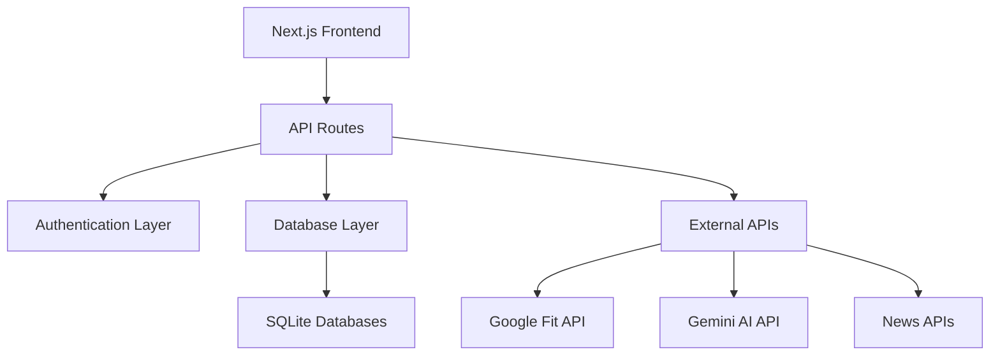

# StepUp - Comprehensive Fitness & Finance Tracking Platform


StepUp is a modern Next.js application that combines fitness tracking, financial management, AI-powered assistance, and comprehensive analytics in one unified platform. Built with cutting-edge technologies, it offers seamless integration with Google Fit, virtual wallet functionality, and intelligent chatbot capabilities.

## 🌟 Key Features

- **🏃‍♂️ Google Fit Integration**: Sync and track daily step counts with competitive leaderboards
- **💰 Virtual Wallet System**: Manage deposits, withdrawals, and transaction history
- **🤖 AI-Powered Chatbot**: Interactive assistance powered by Google's Gemini AI
- **📊 Admin Dashboard**: Comprehensive user management and analytics
- **📱 Responsive Design**: Optimized for desktop, tablet, and mobile devices
- **🔒 Secure Authentication**: JWT-based authentication with HTTP-only cookies
- **⚡ Real-time Updates**: Live data synchronization across all features

## 📸 Application Screenshots

### Home Dashboard


### Google Fit Integration


### Leaderboard System


## 🏗️ Architecture Overview



## 🚀 Quick Start

### Prerequisites

- Node.js 18+ and npm
- Google Cloud Console project
- Google Fit API enabled
- OAuth 2.0 credentials configured

### Installation

1. **Clone the repository**:
   ```bash
   git clone https://github.com/hello-lab/datasprint1.git
   cd datasprint1
   ```

2. **Install dependencies**:
   ```bash
   npm install
   ```

3. **Set up environment variables**:
   ```bash
   cp .env.example .env.local
   ```

4. **Configure your `.env.local`**:
   ```env
   NEXTAUTH_SECRET=your-random-secret-string
   NEXTAUTH_URL=http://localhost:3000
   GOOGLE_CLIENT_ID=your-google-client-id
   GOOGLE_CLIENT_SECRET=your-google-client-secret
   GOOGLE_API_KEY=your-gemini-api-key
   SECRET_KEY=your-existing-secret-key
   ```

5. **Start the development server**:
   ```bash
   npm run dev
   ```

6. **Open your browser**: Navigate to [http://localhost:3000](http://localhost:3000)

## Google Fit Integration

This application includes comprehensive Google Fit integration that allows users to sign in with Google and view their step data for the last 24 hours.

### Setting up Google OAuth Credentials

1. **Create a Google Cloud Project** (if you don't have one):
   - Go to [Google Cloud Console](https://console.cloud.google.com/)
   - Create a new project or select an existing one

2. **Enable Google Fit API**:
   - In the Google Cloud Console, go to "APIs & Services" > "Library"
   - Search for "Fitness API" and enable it

3. **Create OAuth 2.0 Credentials**:
   - Go to "APIs & Services" > "Credentials"
   - Click "Create Credentials" > "OAuth 2.0 Client IDs"
   - Choose "Web application" as the application type
   - Add authorized redirect URIs:
     - For development: `http://localhost:3000/api/auth/callback/google`
     - For production: `https://yourdomain.com/api/auth/callback/google`
   - Save the Client ID and Client Secret

4. **Configure Google Fit API Scopes**:
   The application requests the following Google Fit API scope:
   - `https://www.googleapis.com/auth/fitness.activity.read`: Read access to activity data

### Using the Google Fit Integration

1. Navigate to `/app/googlefit` in your application
2. Click "Sign in with Google" to authenticate
3. Grant permissions for Google Fit access when prompted
4. Click "Fetch Step Data" to view your steps from the last 24 hours
5. View your ranking on the daily leaderboard

## 📊 API Documentation

For complete API documentation with detailed endpoint descriptions, flow charts, and examples, see:
- [📖 API Documentation](./docs/API_DOCUMENTATION.md)
- [🔄 Feature Flow Diagrams](./docs/FEATURE_FLOWS.md)

### Core API Endpoints

| Endpoint | Method | Purpose | Authentication |
|----------|--------|---------|----------------|
| `/api/auth/login` | POST | User authentication | None |
| `/api/auth/signup` | POST | User registration | None |
| `/api/fit` | GET | Google Fit step data | Google OAuth |
| `/api/leaderboard` | GET | Daily step rankings | None |
| `/api/transaction` | POST | Financial transactions | JWT Cookie |
| `/api/gemini` | POST | AI chatbot interaction | None |
| `/api/admin/users` | GET | User management | Admin Token |

## 🗄️ Database Schema

The application uses three SQLite databases:

### Users Database (`users.db`)
```sql
CREATE TABLE users (
  id INTEGER PRIMARY KEY AUTOINCREMENT,
  username TEXT UNIQUE NOT NULL,
  password TEXT NOT NULL,
  balance REAL DEFAULT 100000,
  stepcount INTEGER DEFAULT 0
);
```

### Transactions Database (`transactions.db`)
```sql
CREATE TABLE transactions (
  id INTEGER PRIMARY KEY AUTOINCREMENT,
  userId TEXT NOT NULL,
  amount REAL NOT NULL,
  type TEXT NOT NULL, -- 'deposit' or 'withdraw'
  date TEXT NOT NULL,
  remarks TEXT
);
```

### Steps Database (`steps.db`)
```sql
CREATE TABLE user_steps (
  id INTEGER PRIMARY KEY AUTOINCREMENT,
  user_email TEXT NOT NULL,
  user_name TEXT NOT NULL,
  steps INTEGER NOT NULL,
  date TEXT NOT NULL, -- YYYY-MM-DD format
  created_at TEXT DEFAULT CURRENT_TIMESTAMP
);
```

## 🔐 Security Features

- **Password Hashing**: bcryptjs with salt rounds for secure password storage
- **JWT Authentication**: HTTP-only cookies for session management
- **Input Validation**: Server-side validation for all API endpoints
- **SQL Injection Prevention**: Prepared statements with better-sqlite3
- **CORS Protection**: Next.js default security headers
- **Admin Role Separation**: Separate authentication system for administrative functions

## 🎯 Feature Deep Dive

### 1. Fitness Tracking System
- **Google Fit Integration**: Real-time step data synchronization
- **Daily Leaderboards**: Competitive rankings with medal system
- **Goal Tracking**: 10,000 steps daily target with progress visualization
- **Historical Data**: Persistent storage of daily step counts

### 2. Financial Management
- **Virtual Wallet**: Starting balance of ₹100,000 for all users
- **Transaction Processing**: Secure deposits and withdrawals
- **Balance Validation**: Prevents overdrafts with real-time balance checks
- **Transaction History**: Complete audit trail with timestamps and remarks

### 3. AI-Powered Assistant
- **Gemini AI Integration**: Advanced conversational AI capabilities
- **Real-time Responses**: Instant AI-generated replies
- **Context Awareness**: Maintains conversation context
- **Error Handling**: Graceful fallbacks for API failures

### 4. Admin Dashboard
- **User Analytics**: Comprehensive user activity metrics
- **Data Management**: Real-time user data editing capabilities
- **Export Functionality**: CSV export for data analysis
- **System Monitoring**: User engagement and transaction oversight

## 🚀 Performance Optimizations

- **Database Indexing**: Optimized queries for user lookup and leaderboard generation
- **Response Caching**: Strategic caching for frequently accessed data
- **Lazy Loading**: Components loaded on demand for faster initial load
- **Image Optimization**: Next.js automatic image optimization
- **Code Splitting**: Optimized bundle sizes for better performance

## 📱 Responsive Design

The application is fully responsive and optimized for:
- **Desktop**: Full-featured experience with comprehensive layouts
- **Tablet**: Adapted interfaces with touch-friendly interactions
- **Mobile**: Streamlined UI with essential features prioritized

## 🔧 Development

### Available Scripts

```bash
npm run dev          # Start development server with Turbopack
npm run build        # Build production application
npm run start        # Start production server on port 3003
npm run lint         # Run ESLint for code quality
```

### Project Structure

```
src/
├── app/
│   ├── api/                 # API routes
│   │   ├── auth/           # Authentication endpoints
│   │   ├── admin/          # Admin management endpoints
│   │   ├── fit/            # Google Fit integration
│   │   ├── gemini/         # AI chatbot endpoint
│   │   └── transaction/    # Financial transaction APIs
│   ├── app/                # Application pages
│   │   ├── home/           # Main dashboard
│   │   ├── googlefit/      # Fitness tracking interface
│   │   ├── leaderboard/    # Competition rankings
│   │   ├── profile/        # User profile management
│   │   └── steppe/         # AI chatbot interface
│   ├── db/                 # Database configuration
│   ├── lib/                # Shared libraries and utilities
│   └── utils/              # Helper functions
docs/                       # Comprehensive documentation
├── API_DOCUMENTATION.md    # Complete API reference
└── FEATURE_FLOWS.md       # Detailed flow diagrams
```

## 🌐 Deployment

### Vercel Deployment (Recommended)

1. **Connect your repository** to Vercel
2. **Configure environment variables** in Vercel dashboard
3. **Deploy automatically** on every push to main branch

### Manual Deployment

1. **Build the application**:
   ```bash
   npm run build
   ```

2. **Start production server**:
   ```bash
   npm run start
   ```

### Environment Variables for Production

Ensure all environment variables are configured in your production environment:

```env
NEXTAUTH_SECRET=production-secret-string
NEXTAUTH_URL=https://yourdomain.com
GOOGLE_CLIENT_ID=production-google-client-id
GOOGLE_CLIENT_SECRET=production-google-client-secret
GOOGLE_API_KEY=production-gemini-api-key
SECRET_KEY=production-secret-key
```

## 📈 Monitoring & Analytics

The admin dashboard provides comprehensive monitoring:
- **User Engagement**: Active users and registration trends
- **Financial Metrics**: Transaction volumes and user balances
- **Fitness Analytics**: Step count distributions and leaderboard statistics
- **System Health**: API response times and error rates

## 🤝 Contributing

1. Fork the repository
2. Create a feature branch: `git checkout -b feature/amazing-feature`
3. Commit your changes: `git commit -m 'Add amazing feature'`
4. Push to the branch: `git push origin feature/amazing-feature`
5. Open a Pull Request

## 📄 License

This project is licensed under the MIT License - see the [LICENSE](LICENSE) file for details.

## 🛠️ Technology Stack

- **Frontend**: Next.js 15, React 19, Tailwind CSS
- **Backend**: Next.js API Routes, Node.js
- **Database**: SQLite with better-sqlite3
- **Authentication**: NextAuth.js, JWT
- **External APIs**: Google Fit API, Google Gemini AI
- **Deployment**: Vercel (recommended)

## 📞 Support

For support and questions:
- 📧 Create an issue in this repository
- 📖 Check the [documentation](./docs/)
- 💬 Contact the development team

---

Built with ❤️ using Next.js and modern web technologies.
