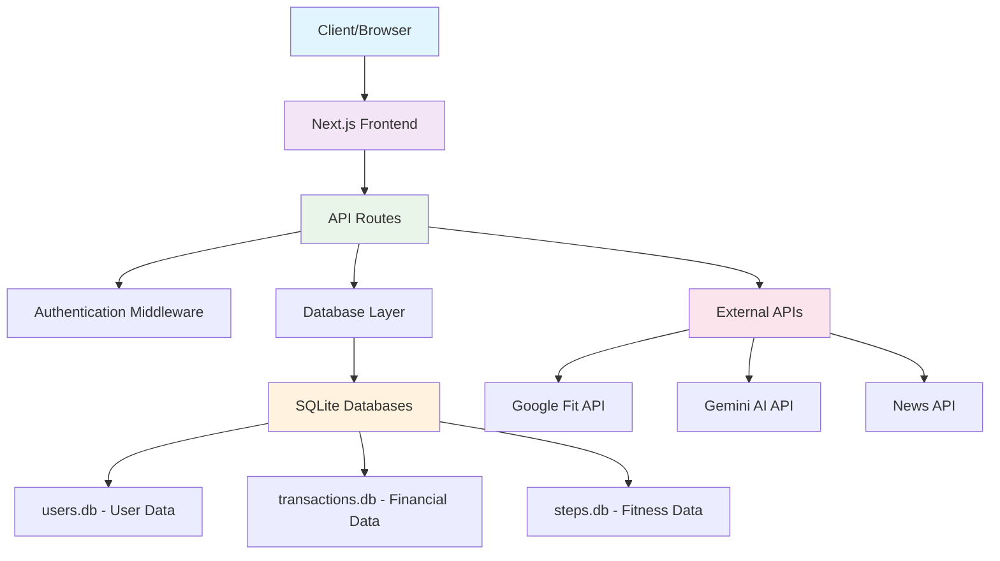
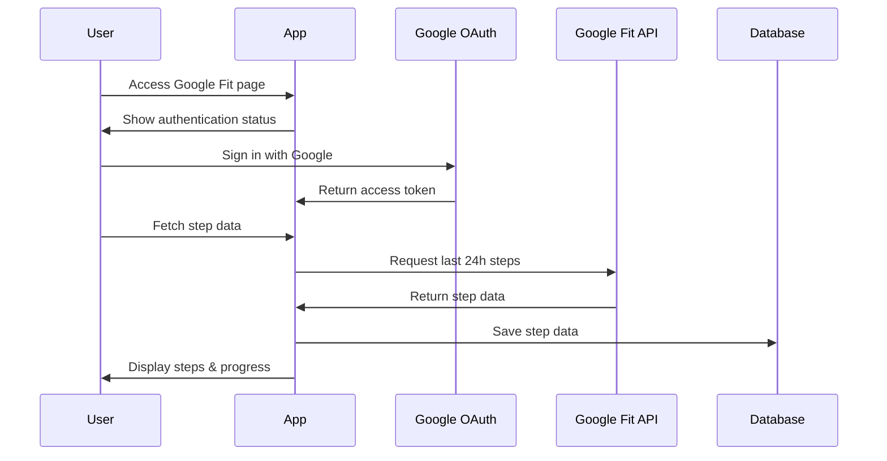
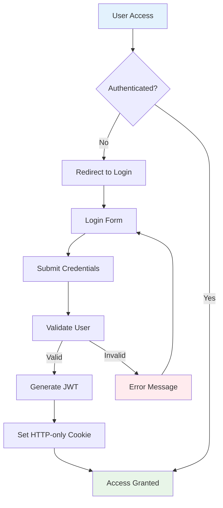
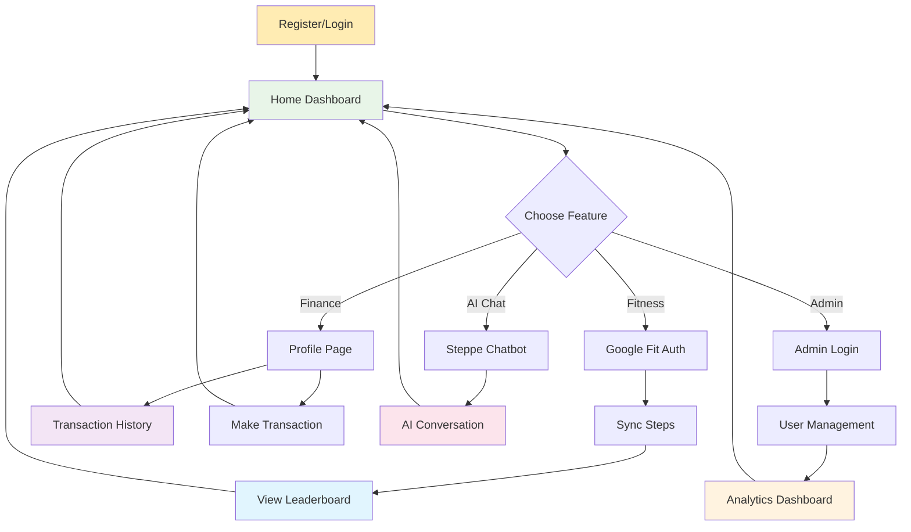
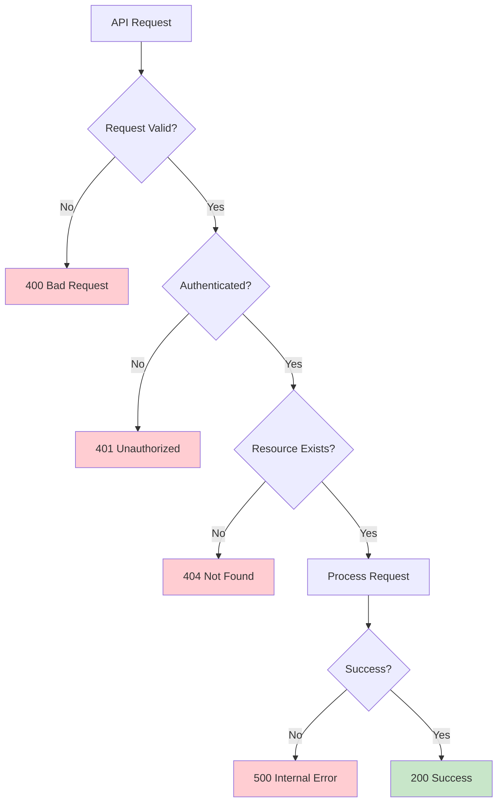

# StepUp Application - Complete API Documentation & Feature Guide

## Overview

StepUp is a comprehensive Next.js application that combines fitness tracking, financial management, AI chatbot functionality, and user analytics. It features Google Fit integration for step tracking, a virtual wallet system, and an admin dashboard for user management.


## Table of Contents
1. [Application Architecture](#application-architecture)
2. [API Endpoints](#api-endpoints)
3. [Features Overview](#features-overview)
4. [Database Schema](#database-schema)
5. [Authentication Flow](#authentication-flow)
6. [User Flows](#user-flows)

---

## Application Architecture



---

## API Endpoints

### Authentication Endpoints

#### 1. User Registration
- **Endpoint**: `POST /api/auth/signup`
- **Purpose**: Create new user account
- **Request Body**:
  ```json
  {
    "username": "string",
    "password": "string"
  }
  ```
- **Response**:
  ```json
  {
    "message": "User Created"
  }
  ```
- **Database**: Creates user with initial balance of ₹100,000

#### 2. User Login
- **Endpoint**: `POST /api/auth/login`
- **Purpose**: Authenticate user and set session cookie
- **Request Body**:
  ```json
  {
    "username": "string",
    "password": "string"
  }
  ```
- **Response**:
  ```json
  {
    "message": "Login successful"
  }
  ```
- **Sets HTTP-only cookie**: `token` with JWT

#### 3. User Profile
- **Endpoint**: `POST /api/auth/profile`
- **Purpose**: Get current user profile data
- **Headers**: Requires authentication cookie
- **Response**:
  ```json
  {
    "user": {
      "username": "string",
      "balance": "number",
      "stepcount": "number"
    }
  }
  ```

### Financial Transaction Endpoints

#### 4. Transaction Management
- **Endpoint**: `POST /api/transaction`
- **Purpose**: Process deposits and withdrawals
- **Request Body**:
  ```json
  {
    "user": "string",
    "amount": "number",
    "type": "deposit" | "withdraw",
    "remarks": "string"
  }
  ```
- **Response**:
  ```json
  {
    "balance": "number"
  }
  ```
- **Business Logic**:
  - Deposits: Add amount to user balance
  - Withdrawals: Subtract if sufficient balance exists
  - All transactions logged with timestamp

#### 5. Transaction History
- **Endpoint**: `POST /api/history`
- **Purpose**: Retrieve user transaction history
- **Headers**: Requires authentication cookie
- **Response**:
  ```json
  {
    "trans": [
      {
        "userId": "string",
        "amount": "number",
        "type": "string",
        "date": "ISO_string",
        "remarks": "string"
      }
    ]
  }
  ```

### Fitness Tracking Endpoints

#### 6. Google Fit Integration
- **Endpoint**: `GET /api/fit`
- **Purpose**: Fetch step data from Google Fit API
- **Headers**: Requires Google OAuth access token
- **Response**:
  ```json
  {
    "steps": "number",
    "timeRange": {
      "start": "ISO_string",
      "end": "ISO_string"
    },
    "rawData": "object"
  }
  ```
- **Time Range**: Last 24 hours
- **Storage**: Automatically saves to steps database

#### 7. Leaderboard
- **Endpoint**: `GET /api/leaderboard`
- **Purpose**: Get daily step count rankings
- **Response**:
  ```json
  {
    "success": true,
    "date": "YYYY-MM-DD",
    "leaderboard": [
      {
        "rank": "number",
        "user_name": "string",
        "user_email": "string",
        "steps": "number",
        "date": "string",
        "created_at": "string"
      }
    ],
    "totalUsers": "number"
  }
  ```

### AI & Content Endpoints

#### 8. Gemini AI Chatbot
- **Endpoint**: `POST /api/gemini`
- **Purpose**: Interact with Google's Gemini AI
- **Request Body**:
  ```json
  {
    "message": "string"
  }
  ```
- **Response**:
  ```json
  {
    "reply": "string"
  }
  ```
- **Integration**: Google Generative AI API

#### 9. News Fetching
- **Endpoint**: `POST /api/news`
- **Purpose**: Proxy for external news APIs
- **Request Body**:
  ```json
  {
    "url": "string"
  }
  ```
- **Response**: Proxied response from target URL

### Admin Endpoints

#### 10. Admin Authentication
- **Endpoints**: 
  - `POST /api/admin/auth/login`
  - `POST /api/admin/auth/logout`
  - `POST /api/admin/auth/setup`

#### 11. User Management
- **Endpoint**: `GET /api/admin/users`
- **Purpose**: Get comprehensive user analytics
- **Response**:
  ```json
  {
    "success": true,
    "users": [
      {
        "id": "number",
        "username": "string",
        "balance": "number",
        "stepcount": "number",
        "max_steps": "number",
        "days_logged": "number",
        "user_email": "string",
        "total_transactions": "number",
        "total_deposits": "number",
        "total_withdrawals": "number"
      }
    ],
    "total_users": "number"
  }
  ```

- **Endpoint**: `PUT /api/admin/users`
- **Purpose**: Update user data
- **Request Body**:
  ```json
  {
    "id": "number",
    "updates": {
      "balance": "number",
      "stepcount": "number"
    }
  }
  ```

---

## Features Overview

### 1. Home Page


**Features:**
- Professional landing page with modern design
- Navigation to all application features
- Feature highlights and services showcase
- Quick access buttons to main functionalities

### 2. Google Fit Integration


**Features:**
- OAuth integration with Google Fit
- 24-hour step data retrieval
- Daily goal tracking (10,000 steps target)
- Progress visualization
- Automatic database synchronization

**User Flow:**


### 3. Leaderboard System


**Features:**
- Daily step count rankings
- Medal system (🥇🥈🥉🏅)
- User statistics dashboard
- Real-time refresh capability
- Responsive design with gradient styling

### 4. Virtual Wallet System

**Features:**
- Deposit and withdrawal transactions
- Real-time balance updates
- Transaction history tracking
- Balance validation for withdrawals
- Detailed transaction logging with remarks

### 5. AI Chatbot (Steppe)

**Features:**
- Google Gemini AI integration
- Real-time conversation interface
- Message history
- Error handling for API failures
- Modern chat UI design

### 6. User Profile Management

**Features:**
- User information display
- Current balance and step count
- Complete transaction history
- Secure logout functionality
- Profile picture support

### 7. Admin Dashboard

**Features:**
- Comprehensive user analytics
- User data editing capabilities
- Export to CSV functionality
- Real-time statistics
- User activity monitoring
- Financial transaction oversight

---

## Database Schema

### Users Table (`users.db`)
```sql
CREATE TABLE users (
  id INTEGER PRIMARY KEY AUTOINCREMENT,
  username TEXT UNIQUE NOT NULL,
  password TEXT NOT NULL,
  balance REAL DEFAULT 100000,
  stepcount INTEGER DEFAULT 0
);
```

### Transactions Table (`transactions.db`)
```sql
CREATE TABLE transactions (
  id INTEGER PRIMARY KEY AUTOINCREMENT,
  userId TEXT NOT NULL,
  amount REAL NOT NULL,
  type TEXT NOT NULL, -- 'deposit' or 'withdraw'
  date TEXT NOT NULL,
  remarks TEXT
);
```

### Steps Table (`steps.db`)
```sql
CREATE TABLE user_steps (
  id INTEGER PRIMARY KEY AUTOINCREMENT,
  user_email TEXT NOT NULL,
  user_name TEXT NOT NULL,
  steps INTEGER NOT NULL,
  date TEXT NOT NULL, -- YYYY-MM-DD format
  created_at TEXT DEFAULT CURRENT_TIMESTAMP
);
```

---

## Authentication Flow



### JWT Token Structure
```javascript
{
  "username": "user123",
  "iat": 1635789012,
  "exp": 1635792612
}
```

---

## User Flows

### Complete User Journey



### Error Handling Flow



---

## Security Features

1. **Password Hashing**: bcryptjs with salt rounds
2. **JWT Authentication**: HTTP-only cookies for session management
3. **Input Validation**: Server-side validation for all endpoints
4. **SQL Injection Prevention**: Prepared statements with better-sqlite3
5. **CORS Protection**: Next.js default security headers
6. **Admin Role Separation**: Separate authentication system for admin functions

---

## Performance Optimizations

1. **Database Indexing**: Optimized queries for user lookup and leaderboard
2. **Caching**: Step data cached for 24-hour periods
3. **Lazy Loading**: Components loaded on demand
4. **Image Optimization**: Next.js automatic image optimization
5. **API Response Caching**: Leaderboard data cached for better performance

---

## Development Setup

1. **Environment Variables Required**:
   ```env
   GOOGLE_API_KEY=your_gemini_api_key
   GOOGLE_CLIENT_ID=your_oauth_client_id
   GOOGLE_CLIENT_SECRET=your_oauth_secret
   NEXTAUTH_SECRET=your_nextauth_secret
   ```

2. **Database Initialization**:
   - SQLite databases created automatically
   - Initial admin setup via `/api/admin/auth/setup`

3. **OAuth Setup**:
   - Google Console project with Fit API enabled
   - Authorized redirect URIs configured
   - Scopes: `fitness.activity.read`

---

## API Rate Limits & Quotas

- **Google Fit API**: 1,000 requests per day (default)
- **Gemini AI**: Based on Google Cloud quota
- **Database**: No artificial limits, SQLite performance dependent
- **File Upload**: Not implemented in current version

---

This documentation provides a comprehensive overview of the StepUp application's API endpoints, features, and technical implementation. The application successfully integrates multiple complex systems while maintaining a clean, user-friendly interface.