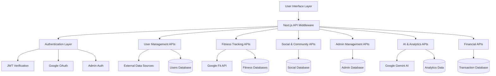
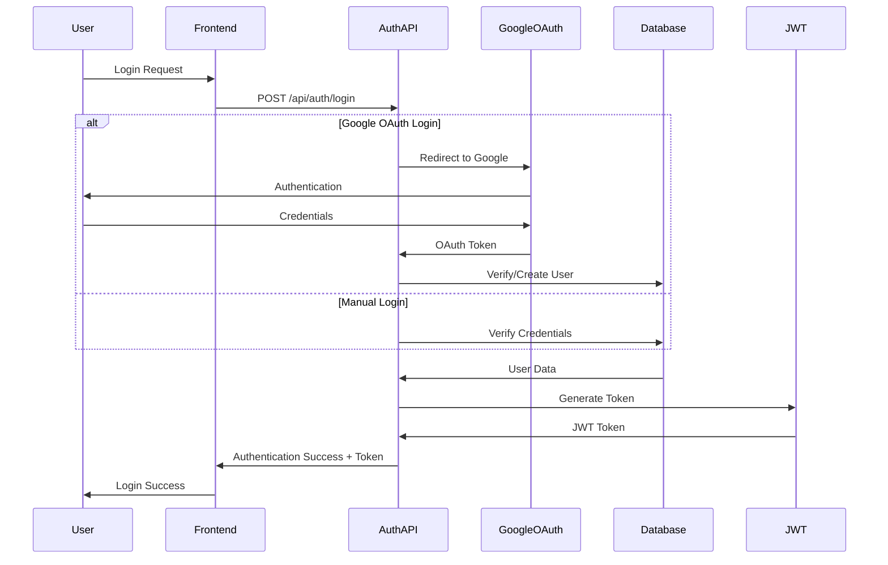
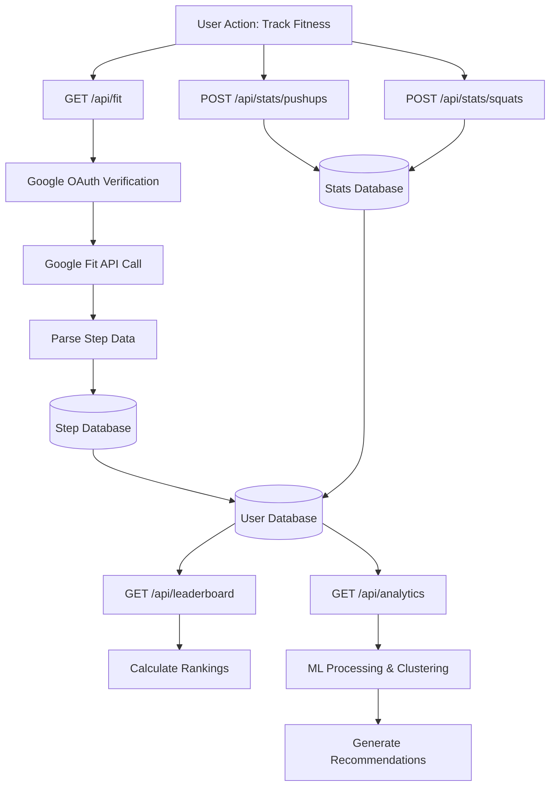
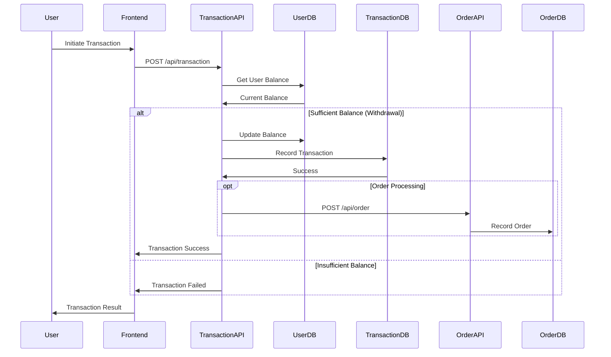
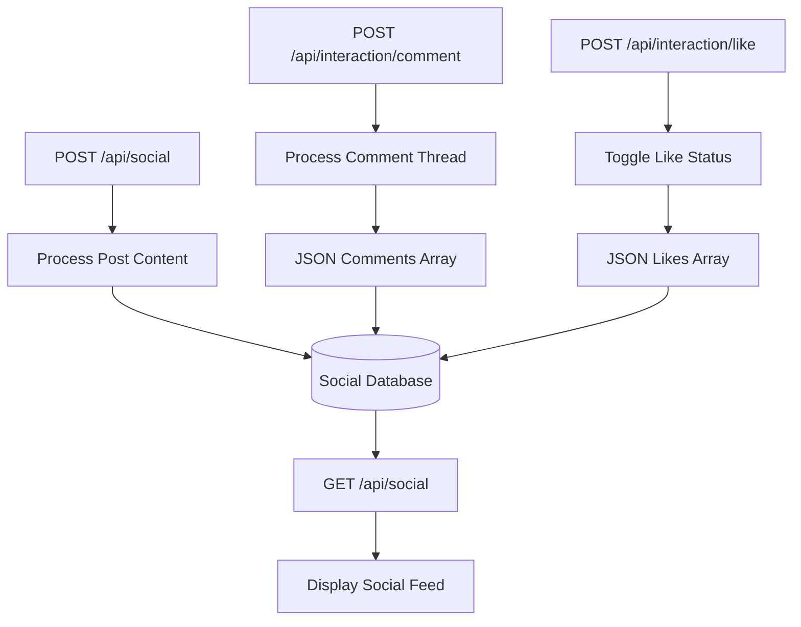
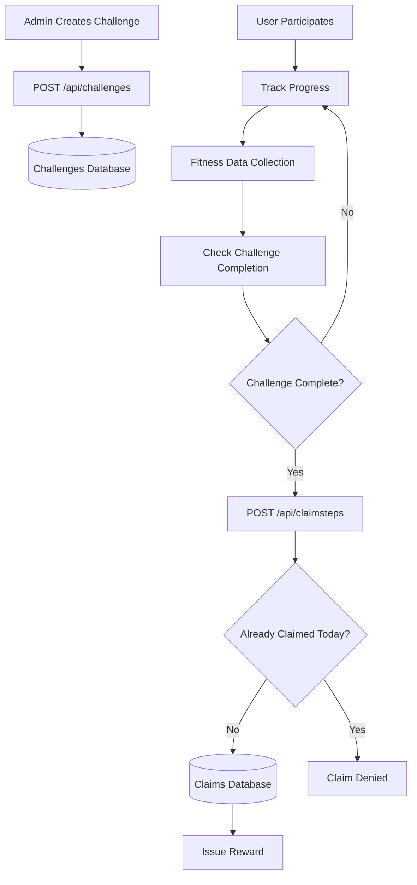
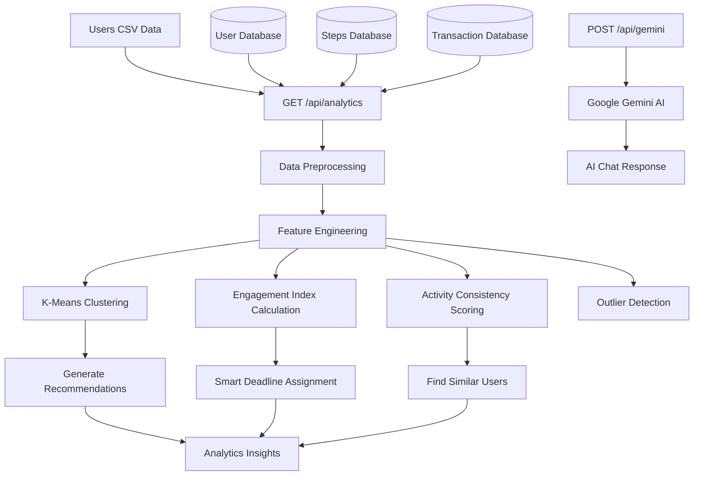
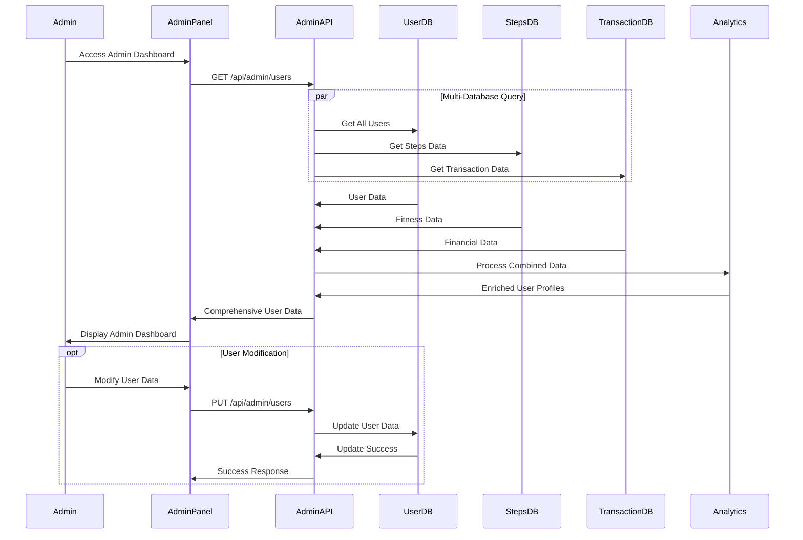
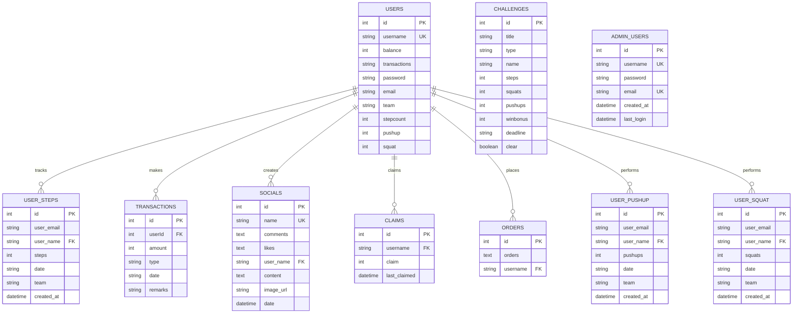

# 🔌 API Architecture & Flowchart Documentation

This document provides comprehensive flowcharts and architectural diagrams for all APIs in the DataSprint1 platform.

## 🏗️ Overall API Architecture

## 🔐 Authentication Flow Diagram

## 🏃 Fitness Tracking API Flow

## 💰 Financial Transaction Flow

## 🤝 Social Features Architecture

## 🏆 Challenge & Rewards System

## 🤖 AI & Analytics Pipeline

## 👨‍💼 Admin Management Flow

## 📊 Data Flow & Database Relationships

## 🔄 API Endpoint Summary

### Authentication & User Management
- `POST /api/auth/login` - User authentication
- `POST /api/auth/signup` - User registration
- `GET /api/auth/profile` - User profile retrieval
- `GET /api/users` - Public user data query

### Fitness & Health Tracking
- `GET /api/fit` - Google Fit integration
- `POST /api/stats/pushups` - Pushup tracking
- `POST /api/stats/squats` - Squat tracking
- `GET /api/leaderboard` - Fitness leaderboards

### Social & Community
- `POST /api/social` - Create social posts
- `GET /api/social` - Retrieve social feed
- `POST /api/interaction/comment` - Add comments
- `POST /api/interaction/like` - Toggle likes

### Challenges & Rewards
- `POST /api/challenges` - Create challenges
- `POST /api/claimsteps` - Claim step rewards
- `POST /api/claim` - General claim processing

### Financial & E-commerce
- `POST /api/transaction` - Process transactions
- `POST /api/history` - Transaction history
- `POST /api/order` - Order processing

### AI & Analytics
- `POST /api/gemini` - AI chat integration
- `GET /api/analytics` - ML-powered analytics

### Admin & Management
- `POST /api/admin/auth/login` - Admin authentication
- `GET /api/admin/users` - User management
- `PUT /api/admin/users` - User data updates

### Content & External Data
- `POST /api/news` - News content aggregation
- `GET /api/product_reader` - Product catalog management

## 🚀 Performance Optimization Strategies

1. **Database Indexing**: Optimized queries with proper indexing
2. **Connection Pooling**: Efficient SQLite connection management
3. **Response Caching**: Minimal database hits for repeated requests
4. **Batch Operations**: Efficient bulk data processing
5. **Lazy Loading**: On-demand data retrieval
6. **Error Handling**: Graceful degradation and fallback mechanisms

This comprehensive API architecture enables scalable, secure, and efficient operation of the DataSprint1 corporate wellness platform.