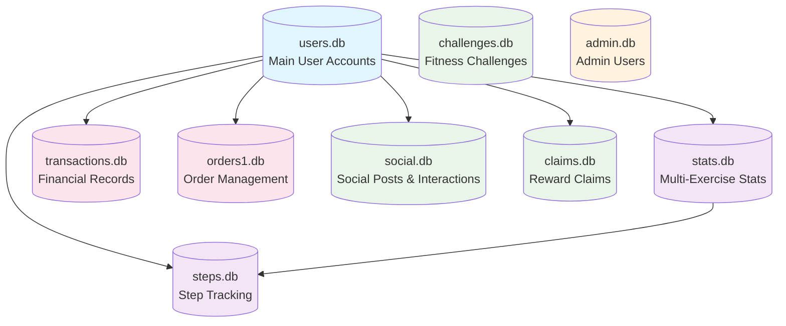

# 🗃️ Database Schema & Relationships Documentation

This document provides comprehensive database schema documentation with detailed relationships and data flow diagrams for the DataSprint1 platform.

## 🏗️ Complete Database Architecture Overview



## 👥 Core User Management Schema

### Users Table (users.db)
```sql
CREATE TABLE users (
  id INTEGER PRIMARY KEY AUTOINCREMENT,
  username TEXT UNIQUE NOT NULL,
  balance INTEGER DEFAULT 0,
  transactions TEXT,
  password TEXT NOT NULL,
  email TEXT DEFAULT '',
  team TEXT,
  stepcount INTEGER DEFAULT 0,
  pushup INTEGER DEFAULT 0,
  squat INTEGER DEFAULT 0
);
```

**Purpose**: Central user account management with financial and fitness summaries

**Key Features**:
- **Unique usernames** for identity management
- **Integrated balance tracking** for financial wellness
- **Fitness summary fields** (stepcount, pushup, squat)
- **Team-based organization** for corporate structure
- **Transaction text field** for legacy transaction storage

## 🏃 Fitness & Activity Tracking Schemas

### Step Tracking (steps.db / stats.db)
```sql
CREATE TABLE user_steps (
  id INTEGER PRIMARY KEY AUTOINCREMENT,
  user_email TEXT,
  user_name TEXT,
  steps INTEGER,
  date TEXT,
  team TEXT,
  created_at DATETIME DEFAULT CURRENT_TIMESTAMP,
  UNIQUE(user_name, date)
);
```

### Pushup Tracking (stats.db)
```sql
CREATE TABLE user_pushup (
  id INTEGER PRIMARY KEY AUTOINCREMENT,
  user_email TEXT,
  user_name TEXT,
  pushups INTEGER,
  date TEXT,
  team TEXT,
  created_at DATETIME DEFAULT CURRENT_TIMESTAMP,
  UNIQUE(user_email, date)
);
```

### Squat Tracking (stats.db)
```sql
CREATE TABLE user_squat (
  id INTEGER PRIMARY KEY AUTOINCREMENT,
  user_email TEXT,
  user_name TEXT,
  squats INTEGER,
  date TEXT,
  team TEXT,
  created_at DATETIME DEFAULT CURRENT_TIMESTAMP,
  UNIQUE(user_email, date)
);
```

## 💰 Financial System Schemas

### Transaction Management (transactions.db)
```sql
CREATE TABLE transactions (
  id INTEGER PRIMARY KEY AUTOINCREMENT,
  userId TEXT,
  amount INTEGER,
  type TEXT, -- 'deposit' or 'withdraw'
  date TEXT,
  remarks TEXT
);
```

### Order Management (orders1.db)
```sql
CREATE TABLE orders (
  id INTEGER PRIMARY KEY AUTOINCREMENT,
  orders TEXT, -- JSON or description
  username TEXT
);
```

## 🤝 Social & Community Schemas

### Social Posts (social.db)
```sql
CREATE TABLE socials (
  id INTEGER PRIMARY KEY AUTOINCREMENT,
  name TEXT UNIQUE NOT NULL,
  comments TEXT, -- JSON array of comments
  likes TEXT DEFAULT '[]', -- JSON array of usernames
  user_name TEXT,
  content TEXT,
  image_url TEXT,
  date DATETIME DEFAULT CURRENT_TIMESTAMP,
  UNIQUE(user_name, date)
);
```

**Features**:
- **JSON-based comments** for threaded discussions
- **JSON-based likes** for engagement tracking
- **Image support** for rich content sharing
- **Unique constraint** prevents spam posting

## 🏆 Gamification & Challenge Schemas

### Challenge System (challenges.db)
```sql
CREATE TABLE challenges (
  id INTEGER PRIMARY KEY AUTOINCREMENT,
  title TEXT,
  type TEXT,
  name TEXT,
  steps INTEGER DEFAULT 0,
  squats INTEGER DEFAULT 0,
  pushups INTEGER DEFAULT 0,
  winbonus INTEGER DEFAULT 0,
  deadline TEXT,
  clear BOOLEAN DEFAULT 0
);
```

### Reward Claims (claims.db)
```sql
CREATE TABLE claims (
  id INTEGER PRIMARY KEY AUTOINCREMENT,
  username TEXT,
  claim INTEGER DEFAULT 0,
  last_claimed DATETIME DEFAULT CURRENT_TIMESTAMP
);
```

## 👨‍💼 Administration Schema

### Admin Users (admin.db)
```sql
CREATE TABLE admin_users (
  id INTEGER PRIMARY KEY AUTOINCREMENT,
  username TEXT UNIQUE NOT NULL,
  password TEXT NOT NULL,
  email TEXT UNIQUE,
  created_at DATETIME DEFAULT CURRENT_TIMESTAMP,
  last_login DATETIME
);
```

## 🔄 Data Relationships & Flow Diagram

```mermaid
erDiagram
    %% Core Entities
    USERS {
        int id PK
        string username UK "Unique identifier"
        int balance "Current financial balance"
        string transactions "Legacy transaction data"
        string password "Hashed password"
        string email "User email address"
        string team "Corporate team assignment"
        int stepcount "Total step count"
        int pushup "Total pushup count"
        int squat "Total squat count"
    }
    
    %% Fitness Tracking
    USER_STEPS {
        int id PK
        string user_email
        string user_name FK "References users.username"
        int steps "Daily step count"
        string date "YYYY-MM-DD format"
        string team "Team for leaderboards"
        datetime created_at
    }
    
    USER_PUSHUP {
        int id PK
        string user_email
        string user_name FK "References users.username"
        int pushups "Daily pushup count"
        string date "YYYY-MM-DD format"
        string team
        datetime created_at
    }
    
    USER_SQUAT {
        int id PK
        string user_email
        string user_name FK "References users.username"
        int squats "Daily squat count"
        string date "YYYY-MM-DD format"
        string team
        datetime created_at
    }
    
    %% Financial System
    TRANSACTIONS {
        int id PK
        string userId FK "References users.username"
        int amount "Transaction amount"
        string type "deposit or withdraw"
        string date "Transaction timestamp"
        string remarks "Transaction description"
    }
    
    ORDERS {
        int id PK
        string orders "Order details/JSON"
        string username FK "References users.username"
    }
    
    %% Social Features
    SOCIALS {
        int id PK
        string name UK "Post identifier"
        text comments "JSON array of comments"
        text likes "JSON array of user likes"
        string user_name FK "References users.username"
        text content "Post content"
        string image_url "Optional image"
        datetime date
    }
    
    %% Gamification
    CHALLENGES {
        int id PK
        string title "Challenge title"
        string type "Challenge category"
        string name "Challenge name"
        int steps "Step target"
        int squats "Squat target"
        int pushups "Pushup target"
        int winbonus "Reward amount"
        string deadline "Challenge deadline"
        boolean clear "Completion status"
    }
    
    CLAIMS {
        int id PK
        string username FK "References users.username"
        int claim "Claim amount"
        datetime last_claimed "Last claim timestamp"
    }
    
    %% Administration
    ADMIN_USERS {
        int id PK
        string username UK "Admin username"
        string password "Hashed admin password"
        string email UK "Admin email"
        datetime created_at
        datetime last_login
    }
    
    %% Relationships
    USERS ||--o{ USER_STEPS : "tracks daily"
    USERS ||--o{ USER_PUSHUP : "records"
    USERS ||--o{ USER_SQUAT : "performs"
    USERS ||--o{ TRANSACTIONS : "makes"
    USERS ||--o{ ORDERS : "places"
    USERS ||--o{ SOCIALS : "creates"
    USERS ||--o{ CLAIMS : "submits"
```



## 📊 Data Aggregation & Analytics Patterns

### Leaderboard Data Aggregation
```sql
-- Daily Individual Leaderboard
SELECT 
  user_name,
  user_email,
  steps,
  date,
  team,
  ROW_NUMBER() OVER (ORDER BY steps DESC) as rank
FROM user_steps 
WHERE date = CURRENT_DATE
ORDER BY steps DESC;

-- Team-based Leaderboard
SELECT 
  team,
  SUM(steps) as total_steps,
  COUNT(DISTINCT user_name) as team_members,
  AVG(steps) as avg_steps_per_member
FROM user_steps 
WHERE date = CURRENT_DATE
GROUP BY team
ORDER BY total_steps DESC;
```

### User Analytics Aggregation
```sql
-- Comprehensive User Analytics
SELECT 
  u.id,
  u.username,
  u.balance,
  u.team,
  u.stepcount,
  u.pushup,
  u.squat,
  s.max_steps,
  s.days_logged,
  t.total_transactions,
  t.total_deposits,
  t.total_withdrawals
FROM users u
LEFT JOIN (
  SELECT 
    user_name,
    MAX(steps) as max_steps,
    COUNT(*) as days_logged
  FROM user_steps 
  GROUP BY user_name
) s ON u.username = s.user_name
LEFT JOIN (
  SELECT 
    userId,
    COUNT(*) as total_transactions,
    SUM(CASE WHEN type = 'deposit' THEN amount ELSE 0 END) as total_deposits,
    SUM(CASE WHEN type = 'withdraw' THEN amount ELSE 0 END) as total_withdrawals
  FROM transactions 
  GROUP BY userId
) t ON u.username = t.userId;
```

## 🔒 Data Integrity & Constraints

### Unique Constraints
1. **users.username** - Prevents duplicate user accounts
2. **user_steps(user_name, date)** - One step record per user per day
3. **user_pushup(user_email, date)** - One pushup record per user per day
4. **user_squat(user_email, date)** - One squat record per user per day
5. **socials.name** - Unique post identifiers
6. **admin_users.username** - Unique admin accounts
7. **admin_users.email** - Unique admin email addresses

### Data Validation Patterns
```javascript
// Example validation in API endpoints
const validateUserInput = (userData) => {
  return {
    username: userData.username?.trim(),
    email: userData.email?.toLowerCase(),
    team: userData.team || 'Default',
    balance: Math.max(0, parseInt(userData.balance) || 0)
  };
};

// Prevent SQL injection with parameterized queries
const insertUser = db.prepare(`
  INSERT INTO users (username, email, team, balance)
  VALUES (?, ?, ?, ?)
`);
```

## 📈 Performance Optimization Strategies

### Database Indexing Strategy
```sql
-- Recommended indexes for performance
CREATE INDEX idx_users_username ON users(username);
CREATE INDEX idx_users_team ON users(team);
CREATE INDEX idx_user_steps_date ON user_steps(date);
CREATE INDEX idx_user_steps_user_date ON user_steps(user_name, date);
CREATE INDEX idx_transactions_user ON transactions(userId);
CREATE INDEX idx_transactions_date ON transactions(date);
CREATE INDEX idx_socials_user ON socials(user_name);
CREATE INDEX idx_socials_date ON socials(date);
```

### Query Optimization Patterns
1. **Date-based Partitioning**: Efficient queries for current/recent data
2. **Composite Indexes**: Multi-column indexes for complex queries
3. **Aggregation Optimization**: Pre-calculated summary fields in users table
4. **Connection Pooling**: Reuse database connections

## 🔄 Data Migration & Backup Strategies

### Backup Schema
```sql
-- Regular backup commands
.backup main backup_users.db
.backup steps backup_steps.db
.backup social backup_social.db
-- etc.
```

### Data Migration Patterns
```javascript
// Example migration for new features
const migrateDatabase = () => {
  // Add new columns safely
  db.exec(`
    ALTER TABLE users 
    ADD COLUMN last_active DATETIME DEFAULT CURRENT_TIMESTAMP
  `);
  
  // Create new tables
  db.exec(`
    CREATE TABLE IF NOT EXISTS user_achievements (
      id INTEGER PRIMARY KEY AUTOINCREMENT,
      user_name TEXT,
      achievement_type TEXT,
      achievement_date DATETIME DEFAULT CURRENT_TIMESTAMP
    )
  `);
};
```

## 🚀 Scalability Considerations

### Database Scaling Strategies
1. **Horizontal Partitioning**: Separate databases by date/team
2. **Read Replicas**: Separate read and write operations
3. **Caching Layer**: Redis for frequently accessed data
4. **Archive Strategy**: Move old data to separate archive databases

### Future Enhancement Opportunities
1. **Multi-tenant Architecture**: Support for multiple organizations
2. **Real-time Analytics**: Stream processing for live dashboards
3. **Advanced Reporting**: Data warehouse integration
4. **API Rate Limiting**: Database protection mechanisms

This comprehensive database schema supports the full feature set of DataSprint1 while maintaining data integrity, performance, and scalability for corporate wellness platform requirements.