# StepUp Application - Feature Flow Diagrams

## API Endpoint Flow Charts

### 1. User Authentication Flow


### 2. Google Fit Integration Flow


### 3. Transaction Management Flow


### 4. Leaderboard System Flow

```mermaid
flowchart TD
    A[User Visits Leaderboard] --> B[GET /api/leaderboard]
    B --> C[Get Today's Date]
    C --> D[Query Database]
    D --> E[SELECT user_steps WHERE date = today]
    E --> F[ORDER BY steps DESC]
    F --> G[LIMIT 50]
    G --> H[Add Ranking Numbers]
    H --> I[Calculate Statistics]
    
    I --> J[Total Users Count]
    I --> K[Top Step Count]
    I --> L[Average Steps]
    
    J --> M[Return Leaderboard Data]
    K --> M
    L --> M
    
    M --> N[Display Rankings]
    N --> O[Show Medal Emojis]
    O --> P[🥇 🥈 🥉 🏅]
    P --> Q[Apply Gradient Styling]
    Q --> R[Show User Statistics]
    
    %% Refresh Flow
    R --> S[User Clicks Refresh]
    S --> B
    
    %% Empty State
    E --> T{Any Data?}
    T -->|No| U[Show Empty State]
    U --> V[Sync Your Steps Button]
    V --> W[Navigate to Google Fit]
    
    T -->|Yes| F
    
    style A fill:#e1f5fe
    style N fill:#e8f5e8
    style U fill:#fff3e0
```



### 5. AI Chatbot (Gemini) Flow


### 6. Admin Dashboard Flow


### 7. News API Proxy Flow

```mermaid
flowchart TD
    A[User Requests News] --> B[POST /api/news]
    B --> C[Extract URL Parameter]
    C --> D{Valid URL?}
    
    D -->|No| E[Return 400 Error]
    D -->|Yes| F[Fetch External API]
    F --> G[await fetch(url)]
    
    G --> H{Request Success?}
    H -->|No| I[Return 500 Error]
    H -->|Yes| J[Parse Response]
    J --> K[Return Proxied Data]
    
    K --> L[Display News Content]
    
    style A fill:#e3f2fd
    style L fill:#e8f5e8
    style E fill:#ffebee
    style I fill:#ffebee
```

---

## Complete Application Data Flow


---

## Error Handling Patterns

### Authentication Errors


### Database Errors


### External API Errors


---

## Performance Optimization Flows

### Database Query Optimization


### API Response Caching


This comprehensive flow chart documentation illustrates every API endpoint, feature interaction, and data flow within the StepUp application, providing a complete technical overview for developers and stakeholders.