# 🏗️ System Architecture & Visual Diagrams

This document provides comprehensive visual representations of the DataSprint1 system architecture, user flows, and technical implementation.

## 🌐 Complete System Architecture Overview


## 👤 User Journey & Experience Flow


## 🔄 Data Flow Architecture

```mermaid
flowchart LR
    %% Data Sources
    USER_INPUT[👤 User Input<br/>Manual Entry]
    GOOGLE_FIT_DATA[📱 Google Fit<br/>Automatic Sync]
    ADMIN_INPUT[👨‍💼 Admin Input<br/>Management Actions]
    EXTERNAL_DATA[🌐 External APIs<br/>News & Content]
    
    %% Processing Layers
    VALIDATION[✅ Data Validation<br/>& Sanitization]
    AUTHENTICATION[🔐 Authentication<br/>& Authorization]
    BUSINESS_LOGIC[⚙️ Business Logic<br/>Processing]
    
    %% Storage & Analytics
    DATABASE_WRITE[💾 Database<br/>Write Operations]
    ML_PROCESSING[🧠 ML Analytics<br/>Processing]
    
    %% Output Generation
    API_RESPONSE[📡 API Response<br/>Generation]
    UI_UPDATE[🖥️ UI Updates<br/>Real-time Sync]
    NOTIFICATIONS[🔔 Notifications<br/>& Alerts]
    
    %% Connections
    USER_INPUT --> VALIDATION
    GOOGLE_FIT_DATA --> VALIDATION
    ADMIN_INPUT --> AUTHENTICATION
    EXTERNAL_DATA --> VALIDATION
    
    VALIDATION --> AUTHENTICATION
    AUTHENTICATION --> BUSINESS_LOGIC
    
    BUSINESS_LOGIC --> DATABASE_WRITE
    BUSINESS_LOGIC --> ML_PROCESSING
    
    DATABASE_WRITE --> API_RESPONSE
    ML_PROCESSING --> API_RESPONSE
    
    API_RESPONSE --> UI_UPDATE
    API_RESPONSE --> NOTIFICATIONS
```



## 🏃 Fitness Tracking User Flow


## 🤖 AI Assistant Interaction Flow


## 📊 Analytics & ML Processing Pipeline


## 🔐 Security & Authentication Architecture


## 🎯 Performance & Scalability Architecture


## 🔧 Development & Deployment Pipeline

```mermaid
gitgraph
    commit id: "Initial Setup"
    branch feature/analytics
    checkout feature/analytics
    commit id: "ML Analytics"
    commit id: "User Clustering"
    checkout main
    merge feature/analytics
    
    branch feature/social
    checkout feature/social
    commit id: "Social Posts"
    commit id: "Comments & Likes"
    checkout main
    merge feature/social
    
    branch feature/ai
    checkout feature/ai
    commit id: "Gemini Integration"
    commit id: "Personalized Chat"
    checkout main
    merge feature/ai
    
    commit id: "Production Build"
    commit id: "Documentation"
    commit id: "Deployment"
```

This comprehensive architecture documentation provides visual insights into the complete DataSprint1 system, from user interactions to data processing and security implementation.